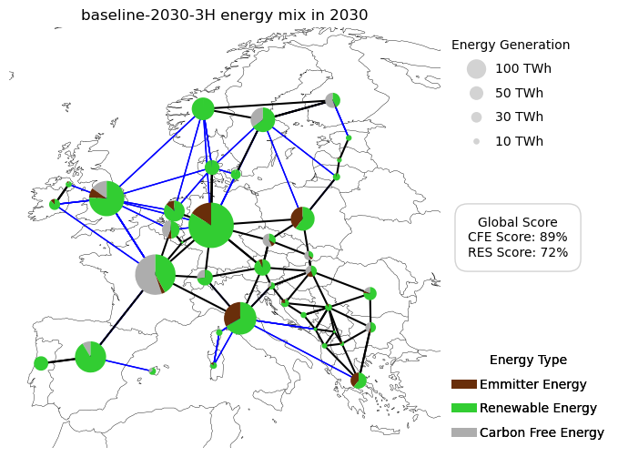

<!--
SPDX-FileCopyrightText: Contributors to PyPSA-Eur <https://github.com/pypsa/pypsa-eur>
SPDX-License-Identifier: CC-BY-4.0
-->

# WattTime Impact Metastudy

This repository is a soft-fork of [OET/PyPSA-Eur](https://github.com/open-energy-transition/pypsa-eur) and contains the entire project **WattTime Impact Metastudy** supported by [Open Energy Transition (OET)](https://openenergytransition.org/)*, including code and visualization. The philosophy behind this repository is that no intermediary results are included, but all results are computed from raw data and code.

This repository is maintained using [OET's soft-fork strategy](https://open-energy-transition.github.io/handbook/docs/Engineering/SoftForkStrategy). OET's primary aim is to contribute as much as possible to the open source (OS) upstream repositories. For long-term changes that cannot be directly merged upstream, the strategy organizes and maintains OET forks, ensuring they remain up-to-date and compatible with upstream, while also supporting future contributions back to the OS repositories.

## Introduction

As companies commit to use 100% clean energy, the question arises: which renewable procurement strategies should they adopt? Existing studies on procurement strategies often focuses on single procurement method or rely on very differing assumptions, by yielding varied results. Instead, this project enables the flexible switching between different procurement strategies and assumptions within a single modeling workflow. Each strategy modelled uses its own particular methods and assumptions, and we attempted to understand where they agreed on impacts and where and why they might have disagreed, without attempting to validate any particular model. In particular, the impacts account for changes in total emissions, costs, and capacity and generation compared to a reference case where no procurement options are available.

The three procurement strategies involved in this project are listed below and were applied to Commercial and Industry (CI) consumers.

1. **Annual Volume matching**: a strategy that seeks to match carbon-free energy (CFE)procurement with annual electricity consumption. It represents the current status of [GHGP Scope 2 market-based accounting standards](https://ghgprotocol.org/sites/default/files/2023-03/Scope%202%20Guidance.pdf). Different matching levels can be considered (i.e., 100% or less).

2. **24/7 Carbon-Free Energy**: strategy that seeks to match electricity consumption with CFE on an hourly basis. Different matching levels can be considered (i.e., 100% or less). Then, it includes locally procured assets and import from the outer grid, in case the matching level is lower than 100%.

3. **Emission Matching**: a strategy that seeks to fully or partially match emissions from the electricity consumption with avoided emissions (according to specific emissions signals) in the locations where CFE is procured. That means to purchase renewable energy from locations where it has the highest impact on emission reduction. The emissions signals included in this analaysis are the following:

    * *Marginal Operating Emissions Rate (MOER)*: Marginal change in emissions from short term changes in load to dispatch of fixed capacity. It can be calculated historically from input grid data using either regression methods, or transmission constraint analysis. It can also be calculated from energy system model results.
    * *Marginal Build Emissions Rate (MBER)*: Marginal change in emissions from long term changes in load to capacity and generation of the grid. It can be calculated historically from recent build using formula described by the GHGP and UNFCCC. It can also be calculated from energy system model results.
    * *Combined Marginal Emission Rate (CMER)*: MOER + MBER. Current guidance suggests to use both signals in some weighted combination.
    * *Average Emissions Rate (AER)*: Average emissions by diving total emissions by total generations. It can be calculated historically or from energy system model results.

[OET](https://openenergytransition.org/), an international non-profit organization specializing in open energy modeling software
development and support, broght its expertise to this project. The organization has a proven track record in promoting transparent, data-driven decision-making in energy policy and
planning, with its software products (including PyPSA-Eur and PyPSA-Earth) used in more than 50 research and industry-related projects.

For further readings of PyPSA and PyPSA-Eur, check out:

* [PyPSA](https://pypsa.readthedocs.io)
* [PyPSA-Eur](https://pypsa-eur.readthedocs.io)
* [PyPSA-Earth](https://pypsa-earth.readthedocs.io)

[WattTime](https://watttime.org/), an environmental tech non-profit organization specializing in technology for electricity grid emissions reductions, supported in the definition of the Emission Matching constraints and data.

## Model Scope

To balance spatial and temporal resolution with computational efficiency, the model’s scope is defined as follows:

- **Spatial Scope**:
  - The model covers 34 countries represented in PyPSA-Eur.
  - A total of 39 nodes are used, ensuring that each country is represented by at least one node.
- **Temporal Scope**:
  - The analysis focuses on the near-term implementation of procurement strategies, specifically for the years 2025 and 2030.
  - Simulations use time resolutions of 1-hour and 3-hour intervals.
- **Sectoral Scope**:
  - The model is limited to the electricity sector, as it is the primary focus for renewable procurement strategies.

To view all the changes in detail, refer to:

* [Base Configuration](https://open-energy-transition.github.io/procurement-metastudy/11-baseline-config.html)
* [Procurement Configuration](https://open-energy-transition.github.io/procurement-metastudy/12-procure-config.html)
* [Features](https://open-energy-transition.github.io/procurement-metastudy/03-features.html)

## PyPSA-Eur: A Sector-Coupled Open Optimisation Model of the European Energy System

PyPSA-Eur is an open model dataset of the European energy system at the
transmission network level that covers the full ENTSO-E area. The model is suitable both for operational studies and generation and transmission expansion planning studies.
The continental scope and highly resolved spatial scale enables a proper description of the long-range
smoothing effects for renewable power generation and their varying resource availability.

The original PyPSA-Eur model is described in the [documentation](https://pypsa-eur.readthedocs.io)
and in the paper [PyPSA-Eur: An Open Optimisation Model of the European Transmission System](https://arxiv.org/abs/1806.01613), 2018,
[arXiv:1806.01613](https://arxiv.org/abs/1806.01613).

The default dataset consists of:

- A grid model based on a prebuilt high voltage-electricity grid (incl. 200 kV and above) extracted from [OpenStreetMap](https://www.openstreetmap.org/). The route and circuit lengths are similar to those found in the official [ENTSO-E Transmission Inventory data](https://www.entsoe.eu/data/power-stats/).
  (alternating current lines at and above 220kV voltage level and all high voltage direct current lines) and 3803 substations.
- The open power plant database [powerplantmatching](https://github.com/PyPSA/powerplantmatching).
- Electrical demand time series from the [OPSD project](https://open-power-system-data.org/).
- Renewable time series based on ERA5 and SARAH, assembled using the [atlite tool](https://github.com/PyPSA/atlite).
- Geographical potentials for wind and solar generators based on land use (CORINE) and excluding nature reserves (Natura2000) are computed with the [atlite library](https://github.com/PyPSA/atlite).

In the default PyPSA-Eur version, a sector-coupled extension adds demand and supply for the following sectors: transport, space and water heating, biomass, industry and industrial feedstocks, agriculture, forestry and fishing. This completes the energy system and includes all greenhouse gas emitters except waste management and land use.

Each of these sectors is built up on the transmission network nodes from [PyPSA-Eur](https://github.com/PyPSA/pypsa-eur):

## Repository structure

* `benchmarks`: will store `snakemake` benchmarks (does not exist initially)
* `config`: configurations used in the study
* `cutouts`: will store raw weather data cutouts from `atlite` (does not exist initially)
* `data`: includes input data that is not produced by any `snakemake` rule
* `doc`: includes all files necessary to build the `readthedocs` documentation of PyPSA-Eur
* `documentation`: includes all files necessary to build the `jupyter book` documentation of WattTime Impact Metastudy version of PyPSA-Eur
* `envs`: includes all the `mamba` environment specifications to run the workflow
* `logs`: will store log files (does not exist initially)
* `notebooks`: includes all the `notebooks` used for ad-hoc analysis
* `resources`: will store intermediate results of the workflow which can be picked up again by subsequent rules (does not exist initially)
* `results`: will store the solved PyPSA network data, summary files and plots (does not exist initially)
* `rules`: includes all the `snakemake`rules loaded in the `Snakefile`
* `scripts`: includes all the Python scripts executed by the `snakemake` rules to build the model

<!--* `report`: contains all files necessary to build the report; plots and result files are generated automatically-->